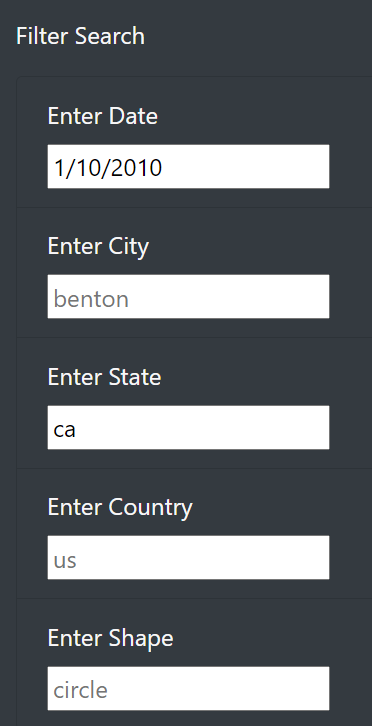
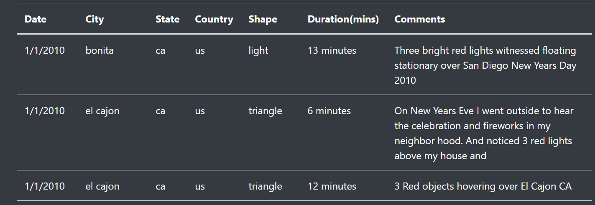
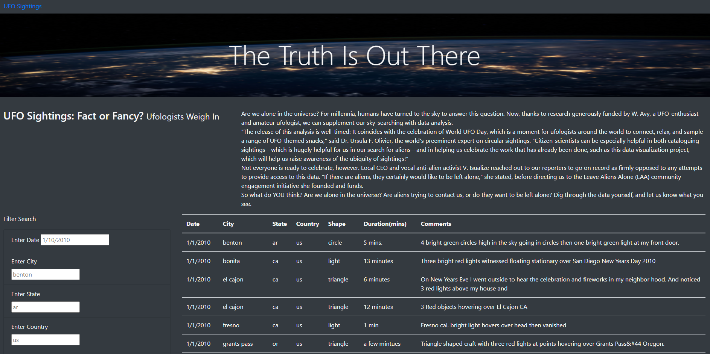

# UFO Sightings Webpage Using JavasScript 

## Overview of the project
The purpose of the project is to create an interactive webpage that takes in user input and filters data and builds a table to show the results. The project uses JavaScript behind the HTML interface to detect user input and carry out the data filtering. 

### Results
The webpage provides the following:
 - A reset button on the top left of the page labeled "UFO Sightings". 
 - An article title and article body with news content regarding UFO sightings.
 - Filter Search Area that filters UFO sightings based on Data, City, State, Country and Shape. 
 The pictures below descrive how to filter tje data:

**Reset the page**  

**Filter table options**  
</img>

**Filter Results**  

**Overall Webpage**  

### Summary